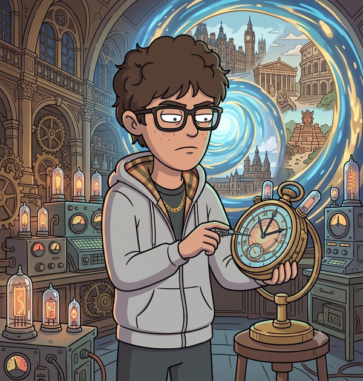

# 👋 Hey, I'm Joseph

**AI Student @ MUST** &nbsp;•&nbsp; **LLM Agent Builder** &nbsp;•&nbsp; **Open Source enthusiast**

---

### 👤 About Me

- 🎓 Studying Artificial Intelligence at **MUST**
- 🧠 Building LLM-powered agents with **LangGraph** & **Python**
- 🔭 Currently exploring multi-agent systems & RAG pipelines
- ⚡ Fun fact: I believe agents should be *composable*, not monolithic

---

### 🛠️ Tech Stack

---

### 📊 GitHub Stats

  
  

---

### 📌 Pinned Projects

---

*Built with ❤️ by Joseph*

