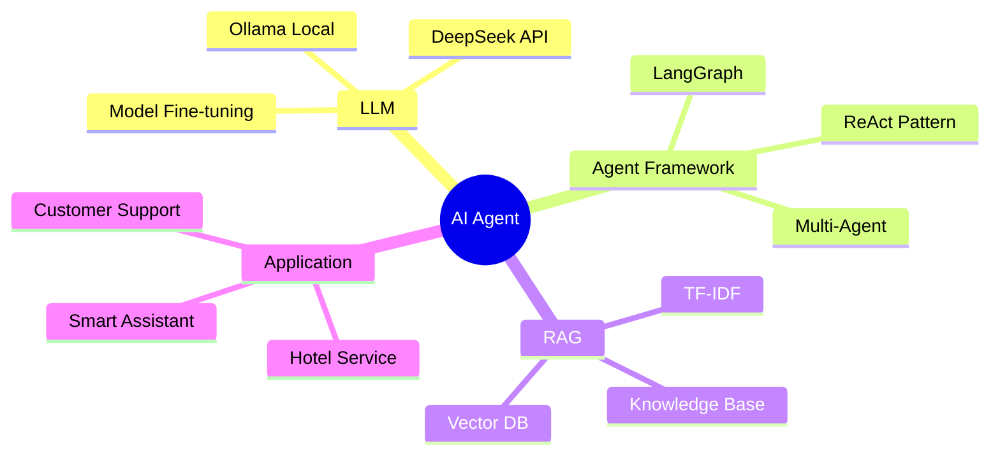

<div align="center">


</div>

---

### 🧠 About Me

```
🎓 CS Student @ Macau University of Science and Technology
🤖 Passionate about LLM-powered Agent applications
🏨 Building Hotel Room Service AI Agent (ReAct + LangGraph)
🔭 Exploring: Multi-Agent Systems · RAG · Local LLM Deployment
🌱 Believing: "LLM is the brain, code is just hands and feet"
```

---

### ⚡ GitHub Stats

<div align="center">
  
  
</div>

<div align="center">
  
</div>

<div align="center">
  
</div>

---

### 🛠️ Tech Stack

<div align="center">


</div>

---

### 🚀 Featured Projects

<div align="center">

<a href="https://github.com/JosephHu04/hotel-room-service-agent-v3">
  
</a>
<a href="https://github.com/JosephHu04/hotel-room-service-agent-v2">
  
</a>

</div>

---

### 📊 This Week's Coding

<div align="center">
  
</div>

---

### 🎯 Current Focus



---

<div align="center">


---

### 🤝 Let's Connect

[](https://github.com/JosephHu04)
[](mailto:1230002465@student.must.edu.mo)

---

> *"The best way to predict the future is to build it."*
>
> *"预测未来最好的方式就是把它造出来。"*

</div>
